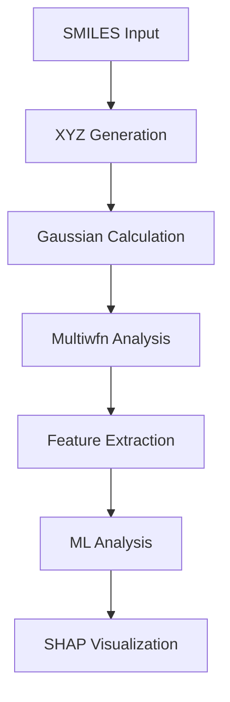

# Surfacia Sphinx 文档网站框架设计

## 📁 整体目录结构
```
docs/
├── source/
│   ├── index.rst                    # 主页
│   ├── conf.py                      # Sphinx 配置
│   ├── getting_started/             # 快速开始
│   │   ├── index.rst
│   │   ├── installation.rst
│   │   ├── quick_start.rst
│   │   └── basic_concepts.rst
│   ├── user_guide/                  # 用户指南
│   │   ├── index.rst
│   │   ├── workflow_overview.rst
│   │   ├── cli_commands.rst
│   │   └── best_practices.rst
│   ├── tutorials/                   # 教程案例
│   │   ├── index.rst
│   │   ├── basic_workflow.rst
│   │   ├── advanced_analysis.rst
│   │   ├── custom_descriptors.rst
│   │   └── jupyter_integration.rst
│   ├── commands/                    # 命令详细说明
│   │   ├── index.rst
│   │   ├── workflow.rst
│   │   ├── ml_analysis.rst
│   │   ├── shap_viz.rst
│   │   ├── utilities.rst
│   │   └── troubleshooting.rst
│   ├── api/                         # API 文档
│   │   ├── index.rst
│   │   ├── core.rst
│   │   ├── analysis.rst
│   │   ├── visualization.rst
│   │   └── utils.rst
│   ├── examples/                    # 实例展示
│   │   ├── index.rst
│   │   ├── drug_discovery.rst
│   │   ├── material_science.rst
│   │   └── academic_research.rst
│   └── _static/                     # 静态文件
│       ├── css/
│       ├── js/
│       └── images/
├── build/                           # 构建输出
└── requirements.txt                 # 文档依赖
```

## 🏠 主要页面内容规划

### 1. **首页 (index.rst)**
- Surfacia 软件简介和核心特性
- 快速导航到各个功能模块
- 最新更新和版本信息
- 社区链接和支持信息

### 2. **快速开始 (getting_started/)**
- **安装指南**: 详细的安装步骤和环境配置
- **快速开始**: 5分钟上手教程
- **基本概念**: 量子化学、机器学习、SHAP 解释

### 3. **用户指南 (user_guide/)**
- **工作流概览**: 8步完整流程图解
- **CLI 命令总览**: 所有命令的快速参考
- **最佳实践**: 性能优化和常见问题解决

### 4. **命令详细说明 (commands/)**
每个命令独立页面，包含：

#### **workflow**: 完整工作流命令
- 参数详解和使用场景
- 智能续算功能 (--resume)
- 8步流程详细说明
- 实际案例演示
- 性能优化技巧

#### **ml-analysis**: 机器学习分析
- 算法选择指南 (Random Forest, XGBoost, SVM等)
- 参数调优技巧和最佳实践
- 交叉验证和模型评估
- 结果解读和统计分析
- 自定义特征工程

#### **shap-viz**: SHAP 可视化
- 交互式界面使用指南
- AI 助手功能详解
- 可视化定制选项
- 描述符知识库使用
- 结果导出和报告生成

#### **utilities**: 辅助工具集
- **mol-drawer**: 分子结构绘制和批量处理
- **mol-viewer**: 3D分子查看器和交互功能
- **rerun-gaussian**: 失败任务重算和错误诊断

### 5. **教程案例 (tutorials/)**
- **基础工作流**: 从 SMILES 到 SHAP 的完整流程
- **高级分析**: 自定义描述符和模型优化
- **Jupyter 集成**: 在 Notebook 中使用 Surfacia
- **批量处理**: 大规模分子数据处理技巧

### 6. **实例展示 (examples/)**
- **药物发现**: ADMET 性质预测案例
  - 溶解度预测
  - 毒性评估
  - 血脑屏障透过性
- **材料科学**: 催化剂活性预测
  - 催化效率分析
  - 反应机理研究
- **学术研究**: 发表级别的分析流程
  - 数据预处理
  - 模型验证
  - 结果可视化

### 7. **API 文档 (api/)**
- 自动生成的 Python API 文档
- 核心模块、分析模块、可视化模块详解
- 开发者接口和扩展指南
- 自定义插件开发

## 🎨 特色功能设计

### 1. **交互式代码示例**
```python
# 每个命令都有可复制的代码块
surfacia workflow -i molecules.csv --resume --test-samples "1,2,3"

# 带有实际输出展示
# Output:
# ✓ Step 1-5: Already completed, skipping...
# ⚡ Starting from Step 6: Feature Extraction
# 📊 Processing 150 molecules...
```

### 2. **可视化流程图**


### 3. **实时输出展示**
- 命令执行的实际输出示例
- 错误信息和解决方案
- 进度条和状态指示器

### 4. **多媒体内容**
- 分子结构的 3D 可视化
- SHAP 图表的交互式展示
- 视频教程嵌入
- 动画演示复杂概念

### 5. **搜索和导航**
- 全文搜索功能
- 标签分类系统
- 相关内容推荐
- 快速跳转链接

## 🛠 技术配置

### Sphinx 扩展推荐：
```python
extensions = [
    'sphinx.ext.autodoc',           # 自动 API 文档
    'sphinx.ext.napoleon',          # Google/NumPy 风格文档
    'sphinx.ext.viewcode',          # 源码链接
    'sphinx.ext.intersphinx',       # 交叉引用
    'sphinxcontrib.mermaid',        # 流程图支持
    'sphinx_copybutton',            # 代码复制按钮
    'sphinx_tabs',                  # 多标签页内容
    'sphinx_design',                # 现代设计元素
    'nbsphinx',                     # Jupyter Notebook 集成
]
```

### 主题选择建议：
1. **Furo**: 现代、清洁的设计，适合技术文档
2. **PyData Sphinx Theme**: 科学计算友好，支持丰富的可视化
3. **Book Theme**: 教程书籍风格，适合学习型文档

### 配置文件示例 (conf.py):
```python
project = 'Surfacia'
copyright = '2024, Surfacia Team'
author = 'Surfacia Team'
version = '3.0'
release = '3.0.0'

html_theme = 'furo'
html_title = 'Surfacia Documentation'
html_logo = '_static/images/surfacia_logo.png'

html_theme_options = {
    "sidebar_hide_name": True,
    "light_css_variables": {
        "color-brand-primary": "#2563eb",
        "color-brand-content": "#2563eb",
    },
}
```

## 📊 内容组织策略

### 按用户类型分层：
1. **初学者路径**: 
   - 快速开始 → 基础教程 → 常用命令 → 简单案例
2. **进阶用户路径**: 
   - 高级功能 → 性能优化 → 自定义扩展 → 复杂案例
3. **开发者路径**: 
   - API 文档 → 源码分析 → 贡献指南 → 插件开发

### 按功能模块分类：
1. **计算化学模块**: 
   - Gaussian 集成和优化
   - Multiwfn 后处理
   - 量子化学描述符
2. **机器学习模块**: 
   - 模型训练和验证
   - 特征工程
   - 预测和评估
3. **可视化模块**: 
   - SHAP 解释性分析
   - 分子结构展示
   - 交互式图表
4. **工具集模块**: 
   - 辅助功能
   - 批处理工具
   - 错误诊断

## 🚀 实施建议

### 第一阶段 (核心框架):
1. 创建基础目录结构
2. 配置 Sphinx 和主题
3. 编写主页和快速开始
4. 完成核心命令文档

### 第二阶段 (内容丰富):
1. 添加详细教程和案例
2. 完善 API 文档
3. 集成 Jupyter Notebook
4. 添加多媒体内容

### 第三阶段 (优化完善):
1. 用户体验优化
2. 搜索功能增强
3. 移动端适配
4. 国际化支持

## 📝 文档维护策略

### 自动化流程：
- CI/CD 集成自动构建
- API 文档自动更新
- 代码示例自动测试
- 链接有效性检查

### 版本管理：
- 文档版本与软件版本同步
- 历史版本文档保留
- 变更日志自动生成

这个框架设计充分考虑了 Surfacia 软件的特点，提供了完整的文档结构和丰富的内容规划。您觉得这个设计如何？需要调整哪些部分？